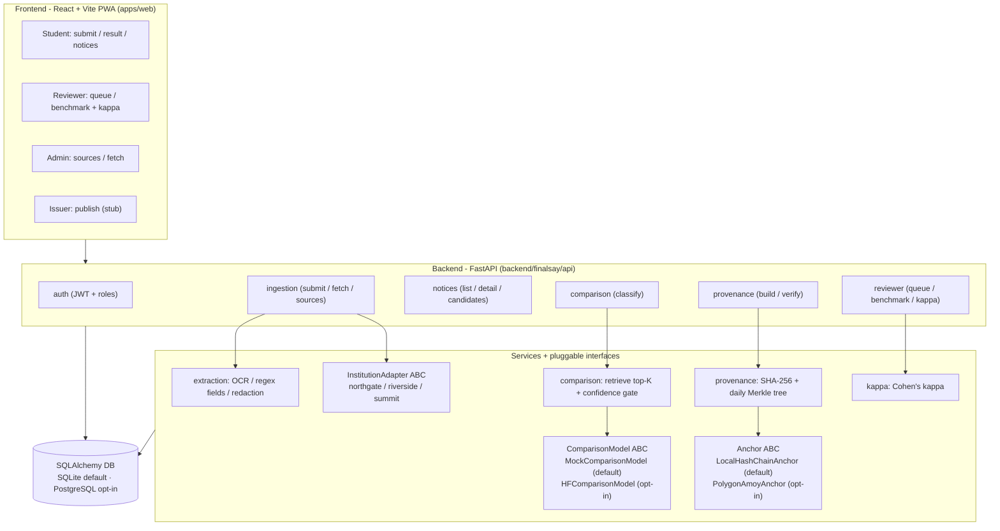

# FinalSay - Results Summary

A report-ready overview of what FinalSay is, how it was evaluated, and what the
numbers actually mean. Every figure here is taken from the committed
`docs/eval-results.md` and `docs/postgres-verification.md`; where the two
disagree, `docs/eval-results.md` wins. Nothing was re-run or re-measured to
produce this document.

## What the system does

We are building a system that takes a student's forwarded institutional notice,
extracts its key information, compares it against verified official notices drawn
from at least three institutions using an ML-based semantic comparison model, and
classifies the relationship as consistent, contradictory, superseded, or
unresolved. It evaluates that classification on a 300+ pair labelled benchmark
against a fully held-out institution and four baselines, and anchors each verified
notice with a blockchain-recorded hash for tamper-evident provenance.

## Architecture

### Layer → component → tech

| Layer | Component | Tech |
| --- | --- | --- |
| Frontend | Student / reviewer / admin / issuer PWA | React 18 + Vite 5 + react-router 6 + axios, `vite-plugin-pwa` (manifest + service worker) |
| API | Auth, ingestion, notices, comparison, provenance, reviewer, issuer routers | FastAPI (synchronous), Pydantic schemas, JWT HS256 (python-jose) + passlib/bcrypt |
| Extraction | Text acquisition, field extraction, PII redaction | `pypdf` (PDF), `pytesseract` (image, engine-permitting), regex field/redaction rules |
| Comparison | Candidate retrieval + relationship classification | Jaccard top-K retrieval; `ComparisonModel` ABC - `MockComparisonModel` (rule engine, default) / `HFComparisonModel` (`transformers` + `torch`, `facebook/bart-large-mnli`, opt-in) |
| Provenance | Canonical hash, daily Merkle tree, anchor | `hashlib` SHA-256; `Anchor` ABC - `LocalHashChainAnchor` (default) / `PolygonAmoyAnchor` (`web3`, opt-in) |
| Reviewer / eval | Two-annotator benchmark, Cohen's kappa, harness + baselines | scikit-learn (`cohen_kappa_score`, P/R/F1) |
| Data | ORM models, relational temporal edges | SQLAlchemy; SQLite default, PostgreSQL opt-in (verified separately) |

Temporal relations are stored as relational `relation_edge` rows, not a graph
database. The swappable parts (comparison model, anchor, institution adapters)
sit behind ABCs so the defaults run fully offline with no paid keys.

## Evaluation setup

- **Corpus:** three fictional institutions - Northgate University, Riverside
  Institute, and Summit College. **Summit is the fully held-out institution**
  used by the `institution` split.
- **Benchmark:** **308 labelled pairs** with **616 annotations** (2 per pair,
  from two independent annotators, `reviewer_a` and `reviewer_b`). Gold labels
  span the full 7-label taxonomy (consistent, contradictory, superseded,
  corrected, extended, cancelled, unresolved), including deliberately ambiguous
  pairs whose gold label is `unresolved`.
- **Inter-annotator agreement:** **Cohen's kappa = 0.625** (substantial but
  imperfect; strictly between 0 and 1).
- **Two holdout splits**, each evaluating **21 held-out pairs**:
  - `temporal` - holds out the latest round of submissions (naturalistic
    phrasing not engineered around the rule engine's cues).
  - `institution` - holds out Summit College entirely (unseen institution).
- **Four baselines** scored on the same splits: `chronological` (predict by
  recency), `page_change` (predict superseded if text changed), `nli`
  (off-the-shelf mapping), `prompted_llm` (prompt-style mock).
- **Two comparison models:** `MockComparisonModel` (default, zero-setup,
  deterministic offline rule engine) and `HFComparisonModel` (opt-in,
  `facebook/bart-large-mnli` zero-shot NLI; weights ~1.6 GB on first run;
  measured runtime ~33 s temporal / ~28 s institution, CPU-only).

Per-field extraction F1, Cohen's kappa, the four baselines, and the entire
time-to-identify metric are **model-independent**, so they are identical across
the MOCK and HF runs - only the FinalSay relationship classification changes.

## Results

### Per-field extraction F1 (model-independent, identical across both splits and both models)

| field | F1 |
| --- | --- |
| issuer | 0.819 |
| date | 1.000 |
| deadline | 1.000 |
| audience | 0.500 |
| action | 0.957 |
| **macro** | **0.855** |

### Relationship metrics - MOCK model (default)

**Temporal split** (21 held-out pairs):

| system | precision | recall | f1 | false_confirmation | unresolved |
| --- | --- | --- | --- | --- | --- |
| **finalsay** | 0.029 | 0.143 | **0.048** | **0.000** | 0.286 |
| chronological | 0.148 | 0.286 | 0.171 | 0.429 | 0.000 |
| page_change | 0.020 | 0.143 | 0.036 | 0.000 | 0.000 |
| nli | 0.100 | 0.286 | 0.143 | 0.143 | 0.000 |
| prompted_llm | 0.119 | 0.286 | 0.167 | 0.143 | 0.000 |

**Institution split** (21 held-out pairs):

| system | precision | recall | f1 | false_confirmation | unresolved |
| --- | --- | --- | --- | --- | --- |
| **finalsay** | 0.847 | 0.714 | **0.739** | **0.000** | 0.190 |
| chronological | 0.168 | 0.333 | 0.200 | 0.429 | 0.000 |
| page_change | 0.020 | 0.143 | 0.036 | 0.000 | 0.000 |
| nli | 0.396 | 0.476 | 0.385 | 0.143 | 0.000 |
| prompted_llm | 0.561 | 0.571 | 0.524 | 0.143 | 0.000 |

### Relationship metrics - HF model (opt-in `facebook/bart-large-mnli` zero-shot NLI)

The baselines are model-independent and are identical to the MOCK blocks above;
only the `finalsay` row changes.

**Temporal split** (21 held-out pairs):

| system | precision | recall | f1 | false_confirmation | unresolved |
| --- | --- | --- | --- | --- | --- |
| **finalsay** | 0.143 | 0.143 | **0.143** | **0.000** | 0.714 |
| chronological | 0.148 | 0.286 | 0.171 | 0.429 | 0.000 |
| page_change | 0.020 | 0.143 | 0.036 | 0.000 | 0.000 |
| nli | 0.100 | 0.286 | 0.143 | 0.143 | 0.000 |
| prompted_llm | 0.119 | 0.286 | 0.167 | 0.143 | 0.000 |

**Institution split** (21 held-out pairs):

| system | precision | recall | f1 | false_confirmation | unresolved |
| --- | --- | --- | --- | --- | --- |
| **finalsay** | 0.305 | 0.333 | **0.289** | **0.000** | 0.714 |
| chronological | 0.168 | 0.333 | 0.200 | 0.429 | 0.000 |
| page_change | 0.020 | 0.143 | 0.036 | 0.000 | 0.000 |
| nli | 0.396 | 0.476 | 0.385 | 0.143 | 0.000 |
| prompted_llm | 0.561 | 0.571 | 0.524 | 0.143 | 0.000 |

### Time-to-identify applicable notice (PROXY, model-independent; lower `mean_scan_cost` is better)

**Temporal split:**

| system | mean_scan_cost | saving_vs_chronological |
| --- | --- | --- |
| **finalsay** | **13.238** | **1.457** |
| chronological | 19.286 | 1.000 |
| page_change | 19.286 | 1.000 |
| nli | 19.286 | 1.000 |
| prompted_llm | 19.286 | 1.000 |

FinalSay retrieval **recall@5 = 0.714**.

**Institution split:**

| system | mean_scan_cost | saving_vs_chronological |
| --- | --- | --- |
| **finalsay** | **9.429** | **1.894** |
| chronological | 17.857 | 1.000 |
| page_change | 17.857 | 1.000 |
| nli | 17.857 | 1.000 |
| prompted_llm | 17.857 | 1.000 |

FinalSay retrieval **recall@5 = 0.810**.

## What these numbers mean

- **The time-to-identify saving is ~1.5x (temporal) to ~1.9x (institution), not
  the ~19x it once appeared to be.** An earlier version of the harness assigned
  FinalSay a fixed scan cost of 1.0 by *assuming* perfect retrieval. That was
  replaced by a measured retrieval rank: FinalSay's cost is now the actual rank
  of the applicable official in the top-K candidate list, and retrieval
  **misses are charged the full institution-feed scan cost, not dropped**.
  Recall@5 is 0.714 (temporal) and 0.810 (institution), so retrieval misses the
  applicable official roughly 19–29% of the time, and those misses pull the mean
  scan cost up. The remaining honest caveat: this proxy replays the retrieval
  *algorithm* over the raw gold notice `text` (idealized, un-redacted inputs),
  whereas the live pipeline scores redacted + field-extracted text, so the
  numbers should be read as an algorithmic proxy over idealized inputs, not a
  live-user timing.

- **The real HF model underperforms the mock on the institution split.** On the
  `institution` split FinalSay's relationship F1 is **0.739 with the mock model
  but only 0.289 with `facebook/bart-large-mnli`** - worse, and below the `nli`
  (0.385) and `prompted_llm` (0.524) baselines on that split. On the `temporal`
  split HF nudges up from a very low base (0.143 vs the mock's 0.048). Both
  models keep FinalSay's **false-confirmation rate at 0.000**, but HF does so
  largely by routing far more cases to `unresolved` (0.714 vs the mock's
  0.286/0.190). These numbers are reported exactly as measured; nothing was
  tuned to make either model look better.

- **What that implies: zero-shot NLI is not enough for this domain.** An
  off-the-shelf entailment model, applied zero-shot, does not reliably
  distinguish the taxonomy's relationships (superseded vs contradictory vs
  extended) on unseen institutions. Whether to **fine-tune the comparison model
  on the benchmark's training split** is the central open question. The
  zero-shot NLI baseline is fixed; the fine-tuning approach is not yet decided.

## Limitations (stated plainly)

- **Synthetic corpus.** All institutions, officials, and submissions are
  deterministically generated fixtures, not real institutional notices.
- **Synthetic annotator disagreement.** The two-annotator labels (and therefore
  the kappa of 0.625) are produced by a deterministic generator that injects
  disagreement on genuinely confusable label pairs; they are not real human
  annotations.
- **Templated benchmark generation.** The 308 benchmark pairs are produced by a
  pure index-driven generator; phrasing variety is cosmetic and never encodes
  the gold label as a machine cue, but the pairs are templated rather than
  organically collected.
- **Retention policy is stated, not enforced.** Redaction-before-storage is
  enforced structurally (the `notice` table stores only `redacted_text`, with no
  unredacted-original column), but the "raw fetched files kept only for the
  duration of project evaluation" clause is an operational policy - the prototype
  has no automated deletion/expiry path.
- **SQLite is the default; PostgreSQL was verified separately.** The demo
  defaults to SQLite for reliability in the sandbox. PostgreSQL was brought up
  for real (via a `postgres:16-alpine` container), had the schema created,
  seeded twice idempotently, and passed a submit/classify + provenance
  build/verify smoke - recorded in `docs/postgres-verification.md`. Note that
  "migrations" there means SQLAlchemy `create_all`, not Alembic, and the default
  pytest suite stays SQLite-pinned.
- **Image OCR is unavailable in this environment.** There is no Tesseract engine
  installed, so image submissions degrade to HTTP 422; PDF and pasted-text paths
  work fully.

## Future work

Tied to the open questions carried by the project:

- **Fine-tuning approach for the comparison model.** The zero-shot NLI baseline
  is fixed; whether to fine-tune on the benchmark's training split (and how) is
  open - and is the direct implication of the HF-vs-mock institution-split result
  above.
- **Final choice of the three institutions and which one is held out.** The
  current held-out institution is Summit College; the final selection is not
  fixed.
- **Task split across the four team members.**
- **Mapping the components to the 17-week schedule.**
